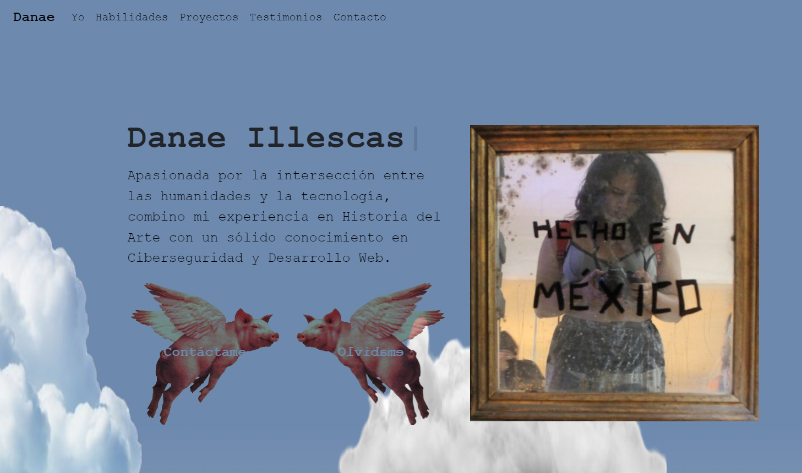
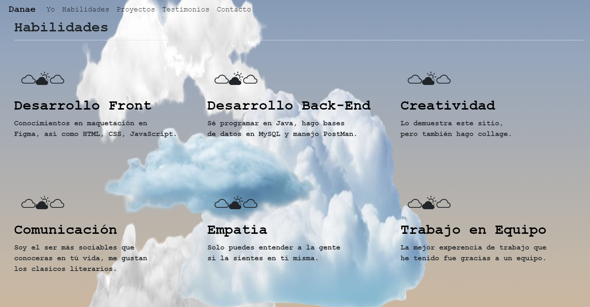
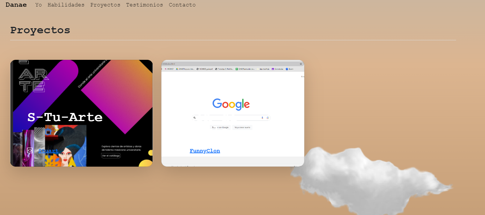
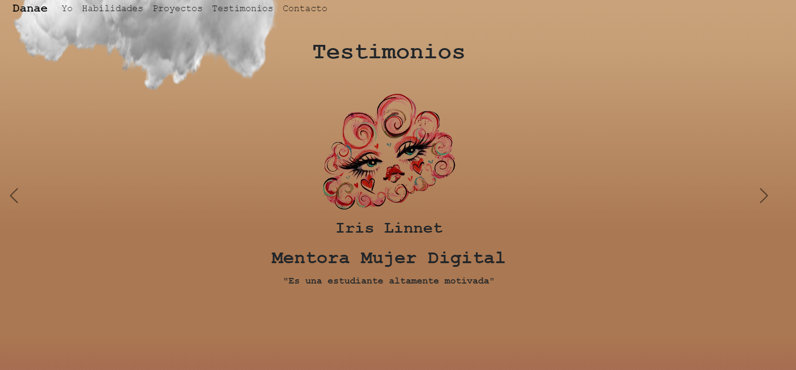
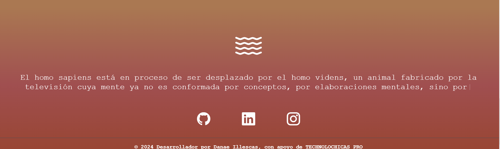

# Portafolio de Habilidades TECHNOLOCHICAS PRO

🏵️El presente proyecto es un portafolio desarrollado para poner en práctica las habilidades obtenidas dentro del bootcamp de desarrollo frontend de Technolochicas PRO.
🏵️Fue desarrollado con HTML, CSS y JS. Además se usó el framework de UI, Bootstrap y se aprovecharon bibliotecas externas.
🏵️La página es responsiva (adaptable a diferentes tamaños de pantalla) e incluye la presentación de la autora del proyecto.
[Proyecto Desplegado (https://danae-illescas-portafolio.vercel.app/)](https://danae-illescas-portafolio.vercel.app/)

## Secciones de mi sitio 

## Tecnologías

* HTML
* CSS
* Bootstrap
* JavaScript

---
Desarrollado con 💗 por Danae Illescas en TECHNOLOCHICAS PRO.  ¨

